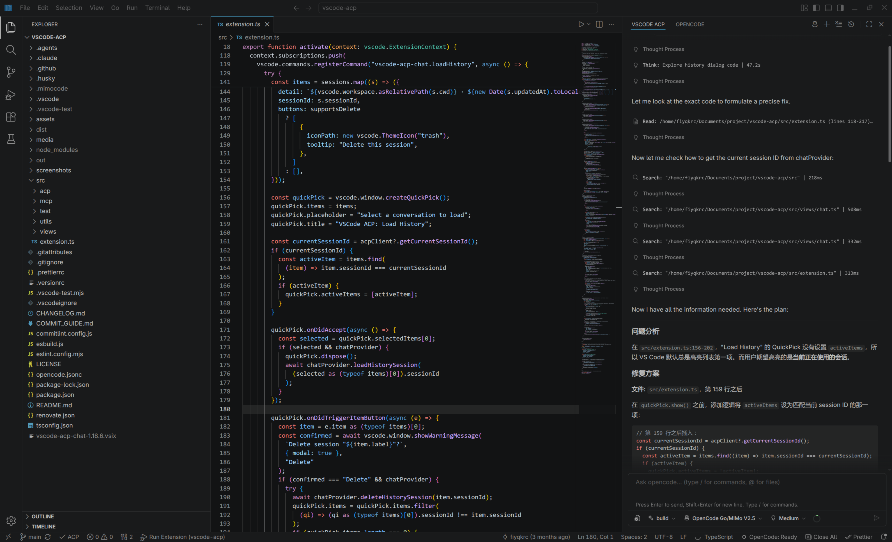

# VSCode ACP Chat

> AI coding agents in VS Code via the Agent Client Protocol (ACP)

[](LICENSE)

[VSCode ACP Chat](https://github.com/pengjiantao/vscode-acp-chat) allows you to chat with Claude, OpenCode, and other ACP-compatible AI agents directly in your editor. No context switching, no copy-pasting code. If you encounter any problems, please report them to [Issues](https://github.com/pengjiantao/vscode-acp-chat/issues).

> **Note:** This is NOT an official ACP protocol or any agent's official VS Code integration. It's a community-driven project. If you find this extension helpful, please consider giving it a ⭐ on [GitHub](https://github.com/pengjiantao/vscode-acp-chat)!



## 🚀 Features

- **Multi-Agent Support** — Connect to OpenCode, Claude Code, Codex CLI, Gemini CLI, Goose, CodeBuddy Code, and other ACP-compatible agents.
- **Native Chat Interface** — Integrated sidebar chat that feels like a native part of VS Code.
- **Context-Aware** — Send code selections or terminal output directly to the chat via context menus.
- **Tool Visibility** — See what commands the AI runs with expandable input/output and file diffs.
- **Rich Markdown** — Full support for code blocks, syntax highlighting, and formatted responses.
- **Streaming Responses** — Watch the AI think and work in real-time.
- **Session Management** — Load and resume previous conversations with full history restoration.
- **Terminal Integration** — View terminal output with full ANSI color support.
- **MCP Server Configuration** — Connect to MCP servers via `stdio`, `http`, or `sse` transports. Configurations are loaded from:
  - Workspace: `<workspace>/.vscode/mcp.json`
  - User-level: `~/.config/Code/User/mcp.json` (Linux), `~/Library/Application Support/Code/User/mcp.json` (macOS), `%APPDATA%/Code/User/mcp.json` (Windows)
  - HTTP/SSE servers are sent to agents based on the agent's advertised `mcpCapabilities`.

## 📦 Getting Started

### Prerequisites

You need at least one ACP-compatible agent installed and available in your `$PATH`:

- **[OpenCode](https://github.com/sst/opencode)**: `pnpm add -g opencode`
- **[Claude Code](https://claude.ai/code)**: `npm install -g @anthropic-ai/claude-code`
- **[Gemini CLI](https://github.com/google/gemini-cli)**: `npm install -g @google/gemini-cli`

> [!IMPORTANT]
> Ensure you have completed the agent's login/authentication setup before connecting via VS Code.

### Installation

1. Open **VS Code**
2. Go to **Extensions** (`Cmd+Shift+X` / `Ctrl+Shift+X`)
3. Search for **"VSCode ACP Chat"**
4. Click **Install**

## 💡 Usage

1. **Connect**: Click the **ACP icon** in the Activity Bar and select an agent to start a session.
2. **Chat**: Type your requests in the input box.
3. **Quick Send**:
   - Highlight code in the editor → Right-click → **Send to ACP**.
   - Select text in the terminal → Right-click → **Send to ACP**.
4. **Inspect Tools**: Click on tool icons (✓, ✗, ⋯) to view command inputs and execution results.

## 🛠️ Configuration

The extension automatically detects installed agents by checking your system's `$PATH` for the following commands:

| Agent          | Command                                     | Detection      |
| -------------- | ------------------------------------------- | -------------- |
| OpenCode       | `opencode acp`                              | Checks `$PATH` |
| Claude Code    | `npx @agentclientprotocol/claude-agent-acp` | Checks `$PATH` |
| Codex CLI      | `npx @agentclientprotocol/codex-acp`        | Checks `$PATH` |
| CodeBuddy Code | `codebuddy --acp`                           | Checks `$PATH` |
| Gemini CLI     | `gemini --acp`                              | Checks `$PATH` |
| Goose          | `goose acp`                                 | Checks `$PATH` |
| Amp            | `amp acp`                                   | Checks `$PATH` |
| Aider          | `aider --acp`                               | Checks `$PATH` |
| Augment Code   | `augment acp`                               | Checks `$PATH` |
| Kimi CLI       | `kimi --acp`                                | Checks `$PATH` |
| Mistral Vibe   | `vibe acp`                                  | Checks `$PATH` |
| OpenHands      | `openhands acp`                             | Checks `$PATH` |
| Qwen Code      | `qwen --acp`                                | Checks `$PATH` |
| Kiro CLI       | `kiro-cli acp`                              | Checks `$PATH` |
| Cursor Cli     | `agent acp`                                 | Checks `$PATH` |

### Custom Agents

You can add custom agents via VS Code settings:

1. Open **Settings** (`Cmd+Shift+P` / `Ctrl+Shift+P` → `Preferences: Open User Settings`)
2. Search for `vscode-acp-chat.customAgents`
3. Click **Edit in settings.json**

#### Example Configuration

```json
{
  "vscode-acp-chat.customAgents": [
    {
      "id": "my-agent",
      "name": "My Custom Agent",
      "command": "my-agent-cli",
      "args": ["--acp"],
      "env": {
        "API_KEY": "your-api-key"
      }
    }
  ]
}
```

#### Configuration Fields

| Field     | Type       | Required | Description                            |
| --------- | ---------- | -------- | -------------------------------------- |
| `id`      | `string`   | Yes      | Unique identifier for the agent        |
| `name`    | `string`   | Yes      | Display name shown in agent selector   |
| `command` | `string`   | Yes      | Executable command                     |
| `args`    | `string[]` | No       | Command-line arguments (default: `[]`) |
| `env`     | `object`   | No       | Environment variables                  |

> [!NOTE]
> Custom agents with the same `id` as a built-in agent will **replace** the built-in configuration.

## 👨‍💻 Development

```bash
# Install dependencies
npm install

# Build the extension
npm run compile

# Package as VSIX
npx vsce package

# Run tests & linting
npm test
npm run lint
npm run format
```

## 🤝 Acknowledgments

This project is an enhanced fork of the original [vscode-acp](https://github.com/omercnet/vscode-acp) repository, adding significant improvements to agent compatibility, session management, and the overall user interface.

## 📄 License

MIT License - see [LICENSE](LICENSE) file for details.

# Service Documentation Skeleton

This skeleton keeps durable service knowledge in `docs/`, lightweight agent routing in `AGENTS.md`, and active multi-step execution in Beads.

Core split:

- `AGENTS.md` — short agent behavior and docs-routing policy.
- `README.md` — service entry point: purpose, owner, runtime, local setup, verification, and important links.
- `docs/` — product, feature, architecture, design, contracts, engineering, operations, and implementation-plan source-of-truth.
- `.beads/` — local Beads boundary notes; actual task graph/status should live in the Beads CLI/store when available.

Do not turn documentation into a task tracker. Use `docs/features/README.md` to know what durable feature context exists, and use Beads to manage active implementation work.
